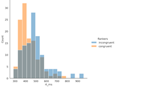
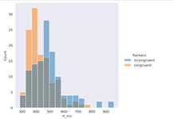

## Visualization of Data


```
import seaborn as sns
# An interesting feature of this is changing background colours
#This is the line which makes a difference when plotting
#by changing the style to 'dark' the graph as a unit stands out more.
#The 'whitegrid' style would be most useful in a graphical sense where you need to visually determine which points something may be located in relation to the bin number, it makes it easier to follow visually, especially for those how may have poor visual interpretation skills. The 'ticks' setting is another useful setting which may be less visually disruptive in presentation, but still provide better guidance as to where the bin locations are in relation to the spread of the data.

#The default is a histogram.
sns.set_style('white')
sns.displot(data=df, x='rt_ms', hue='flankers')
plt.show()



#Now we change to a dark style
sns.set_style('dark')
sns.displot(data=df, x='rt_ms', hue='flankers')
plt.show()
```


###### If a histogram isn't the best type of representation for your data, there are also code options for box plots and bar plots:


```
# Box plots and bar plots are changed very easily using matplotlib as you simply need to replace the phase kind='box' with kind='bar'
sns.catplot(kind='box',
           data=df,
           x='flankers', y='rt_ms')
plt.show()


sns.catplot(kind='bar',
           data=df,
           x='flankers', y='log_rt')

plt.show()


```
