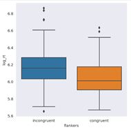
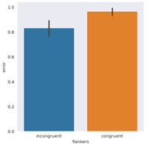

# Visualization of Data


```
import seaborn as sns
# An interesting feature of this is changing background colours
#This is the line which makes a difference when plotting
#by changing the style to 'dark' the graph as a unit stands out more.

#The default is a histogram.
sns.set_style('white')
sns.displot(data=df, x='rt_ms', hue='flankers')
plt.show()
```


```

#Now we change to a dark style
sns.set_style('dark')
sns.displot(data=df, x='rt_ms', hue='flankers')
plt.show()
````


```
```
### Sometimes it's nice to have different types of representation


#If a histogram isn't the best type of representation for your data, there are also code options for box plots and bar plots:

#Box plots and bar plots are changed very easily using seaborn

sns.catplot(kind='box',
           data=df,
           x='flankers', y='rt_ms')
           
plt.show()



```
```

#replace the phase kind='box' with kind='bar'

sns.catplot(kind='bar',
           data=df,
           x='flankers', y='log_rt')
           

plt.show()


